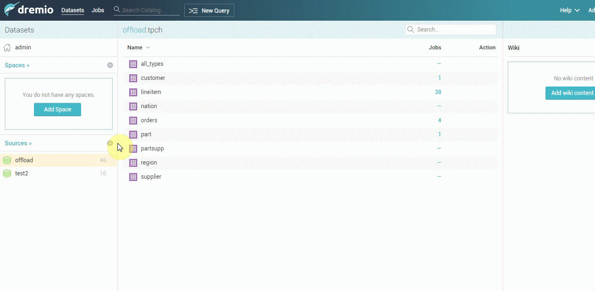

# dremio-tidb

这是一个ARP框架制作的社区版Tidb Dremio连接器

### Dremio
Dremio是一个分布式的分析引擎，可一站式满足实时和海量数据离线即时分析。市场团队以及数据分析师可以更自助地获取数据, 解放开发团队和数据整理团队。

### 插件解决的问题

#### 对tidb开发者： 
* 开源开发，原来的mysql插件是闭源， 不能针对tidb的新功能或特性进行push down操作。插件是开源开发，能够自定义属性和方法进行开发
* 自定义结构，对一些tidb无法进行push down操作的函数不进行push down操作， 减少bug的发生。
#### 对用户
* 减少全量数据加载， 对机器的性能要求变得更少。
* 减少多个数据分析师同时进行数据分析的压力，提高数据分析的效率。


### 插件支持以及经过测试的功能
1. 绝大部分tidb的数据类型的转换支持。
2. 将tidb 50+个函数进行push down。
3. 所有的TPCH的测试语法实现push down。


## 使用

**创建一个Tidb数据源**
**需要的参数:**
1. JDBC URL。
`jdbc:mysql://<host>:<port>/?useUnicode=true&characterEncoding=utf8&autoReconnect=true`
2. 用户名以及密码。

## 开发

**构建和安装**
1. 在带有pom.xml文件的根目录中运行`mvn clean install -DskipTests`。如果要运行测试，请将JDBC jar和所需的环境变量一起添加到本地maven存储库中。
2. 将生成的.jar文件放在目标文件夹中，并将其放在Dremio的<DREMIO_HOME>\jars\文件夹中。
3. 下载 MysqlJDBC (https://repo1.maven.org/maven2/mysql/mysql-connector-java/5.1.48/mysql-connector-java-5.1.48.jar) 驱动放到<DREMIO_HOME>\jars\3rdparty 文件夹下。
4. 重新启动Dremio。

**构建docker镜像详细步骤**

Build:
```bash
# 先执行构建与安装第一步， 再执行后面代码
docker build -f docker/Dockerfile -t dremio-tidb:latest
```
Run:
```bash
docker run -d -p 9047:9047 -p 31010:31010 dremio-tidb:latest
```
## Demo

